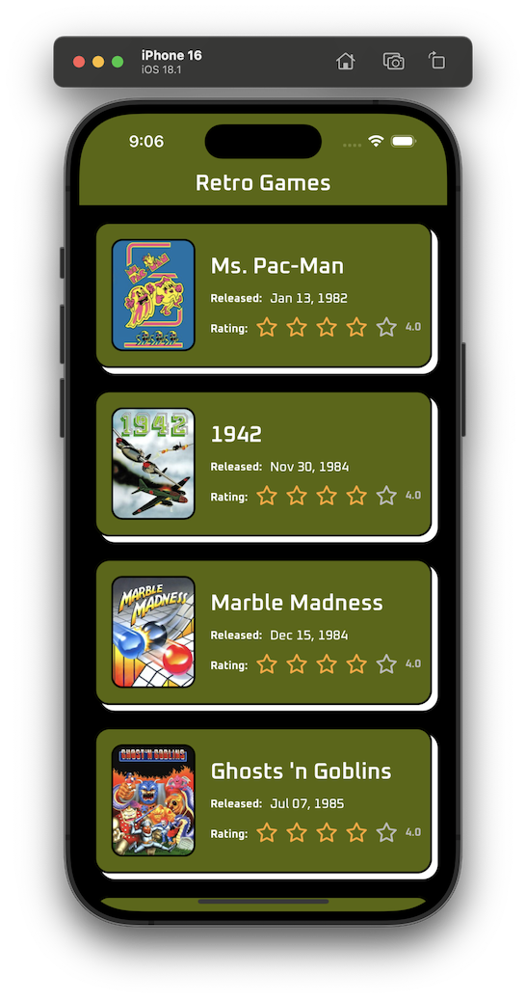

# Chapter 4: Blending In

Run `./scripts/skipTo 4` to copy the solution to your main app, otherwise you may code along. Reference `./solutions/chapter4` if you get stuck.

## Overview

This chapter covers adaptive theming and system integration in React Native. In this chapter you'll implement a dark mode theme within the application.



**Note:** To toggle between light and dark mode, you can use the system settings on your device. Alternatively, you can:

- (iOS) Press `Command + Shift + A` on iOS Simulator to toggle between light and dark mode.
- (Android) In a terminal, enter `adb shell "cmd uimode night no"`, `adb shell "cmd uimode night yes"` to toggle between light and dark mode.

## Learning Objectives

- Implement system-aware theming
- Create light and dark mode support
- Handle theme transitions

## Tasks for this section [code-a-long]

### 1. Check out what the designers sent us

a. Observe `darkColors` and the related tokens

b. Set up the types and helper functions for styling components based on the provided theme

```diff
+export type ThemeContexts = "light" | "dark" | undefined
+export type Colors = typeof colors | typeof darkColors
+export type Sizes = typeof sizes
+export interface Theme {
+  colors: Colors
+  sizes: Sizes
+  isDark: boolean
+}
+
+export const lightTheme: Theme = {
+  colors,
+  sizes,
+  isDark: false,
+}
+export const darkTheme: Theme = {
+  colors: darkColors,
+  sizes,
+  isDark: true,
+}

+ /**
+ * Represents a function that returns a styled component based on the provided theme.
+ * @template T The type of the style.
+ * @param theme The theme object.
+ * @returns The styled component.
+ *
+ * @example
+ * const $container: ThemedStyle<ViewStyle> = (theme) => ({
+ *   flex: 1,
+ *   backgroundColor: theme.colors.background,
+ *   justifyContent: "center",
+ *   alignItems: "center",
+ * })
+ * // Then use in a component like so:
+ * const Component = () => {
+ *   const { themed } = useAppTheme()
+ *   return <View style={themed($container)} />
+ * }
+ */
+export type ThemedStyle<T> = (theme: Theme) => T
+export type ThemedStyleArray<T> = (
+  | ThemedStyle<T>
+  | StyleProp<T>
+  | (StyleProp<T> | ThemedStyle<T>)[]
+)[]
```

c. Create our Theme React Provider & Context

```diff
+type ThemeContextType = {
+  themeScheme: ThemeContexts
+}
+
+// create a React context and provider for the current theme
+export const ThemeContext = createContext<ThemeContextType>({
+  themeScheme: undefined, // default to the system theme
+})
+
+export const useThemeProvider = () => {
+  const colorScheme = useColorScheme()
+  const [overrideTheme, setTheme] = useState<ThemeContexts>(
+    Appearance.getColorScheme() ?? undefined,
+  )
+
+  useEffect(() => {
+    const subscription = Appearance.addChangeListener(({ colorScheme: scheme }) => {
+      setTheme(scheme ?? undefined)
+    })
+
+    return () => subscription.remove()
+  }, [])
+
+  const themeScheme = overrideTheme || colorScheme || "light"
+  const navigationTheme = themeScheme === "dark" ? DarkTheme : DefaultTheme
+
+  return {
+    themeScheme,
+    navigationTheme,
+    ThemeProvider: ThemeContext.Provider,
+  }
+}
```

d. Create our `useAppTheme` hook

```diff
+interface UseAppThemeValue {
+  // The theme object from react-navigation
+  navTheme: typeof DefaultTheme
+  // The current theme object
+  theme: Theme
+  // The current theme context "light" | "dark"
+  themeContext: ThemeContexts
+  // A function to apply the theme to a style object.
+  themed: <T>(styleOrStyleFn: ThemedStyle<T> | StyleProp<T> | ThemedStyleArray<T>) => T
+}
+
+/**
+ * Custom hook that provides the app theme and utility functions for theming.
+ *
+ * @returns {UseAppThemeReturn} An object containing various theming values and utilities.
+ * @throws {Error} If used outside of a ThemeProvider.
+ */
+export const useAppTheme = (): UseAppThemeValue => {
+  const navTheme = useNavTheme()
+  const context = useContext(ThemeContext)
+  if (!context) {
+    throw new Error("useTheme must be used within a ThemeProvider")
+  }
+
+  const { themeScheme: overrideTheme } = context
+
+  const themeContext: ThemeContexts = useMemo(
+    () => overrideTheme || (navTheme.dark ? "dark" : "light"),
+    [overrideTheme, navTheme],
+  )
+
+  const themeVariant: Theme = useMemo(
+    () => (themeContext === "dark" ? darkTheme : lightTheme),
+    [themeContext],
+  )
+
+  const themed = useCallback(
+    <T>(styleOrStyleFn: ThemedStyle<T> | StyleProp<T> | ThemedStyleArray<T>) => {
+      const flatStyles = [styleOrStyleFn].flat(3) as (ThemedStyle<T> | StyleProp<T>)[]
+      const stylesArray = flatStyles.map((f) => {
+        if (typeof f === "function") {
+          return (f as ThemedStyle<T>)(themeVariant)
+        } else {
+          return f
+        }
+      })
+
+      // Flatten the array of styles into a single object
+      return Object.assign({}, ...stylesArray) as T
+    },
+    [themeVariant],
+  )
+
+  return {
+    navTheme,
+    theme: themeVariant,
+    themeContext,
+    themed,
+  }
+}
```

### 2. Add the Theme Provider to the root of the app

a. Wrap `src/app/_layout.tsx` with the `ThemeProvider`

```diff
+ import { fonts, useAppTheme, useThemeProvider } from "@theme/index"

export default function RootLayout() {
+ const { themeScheme, ThemeProvider } = useThemeProvider()
  const { loaded } = useWebFonts()
  if (!loaded) return null

  return (
    <SafeAreaProvider initialMetrics={initialWindowMetrics}>
+     <ThemeProvider value={{ themeScheme }}>
        <GlobalStateProvider>
+         <ThemedStack />
          <Stack
            screenOptions={{
              contentStyle: {
                backgroundColor: colors.background.primary,
                borderTopColor: colors.border.base,
                borderTopWidth: sizes.border.sm,
              },
              headerStyle: {
                backgroundColor: colors.background.brand,
              },
              headerTintColor: colors.text.base,
              headerTitleAlign: "center",
              headerTitleStyle: {
                fontSize: 24,
                fontFamily: fonts.primary.semiBold,
              },
              headerShadowVisible: false,
            }}
          />
        </GlobalStateProvider>
+     </ThemeProvider>
    </SafeAreaProvider>
  )
}
```

b. Move the stack to it's own `ThemedStack` component so we can consume the provider.

```diff
export default function RootLayout() {
  const { themeScheme, ThemeProvider } = useThemeProvider()
  const { loaded } = useWebFonts()
  if (!loaded) return null

  return (
    <SafeAreaProvider initialMetrics={initialWindowMetrics}>
+     <ThemeProvider value={{ themeScheme }}>
        <GlobalStateProvider>
+         <ThemedStack />
-          <Stack
-            screenOptions={{
-              contentStyle: {
-                backgroundColor: colors.background.primary,
-                borderTopColor: colors.border.base,
-                borderTopWidth: sizes.border.sm,
-              },
-              headerStyle: {
-                backgroundColor: colors.background.brand,
-              },
-              headerTintColor: colors.text.base,
-              headerTitleAlign: "center",
-              headerTitleStyle: {
-                fontSize: 24,
-                fontFamily: fonts.primary.semiBold,
-              },
-              headerShadowVisible: false,
-            }}
-          />
        </GlobalStateProvider>
     </ThemeProvider>
    </SafeAreaProvider>
  )
}

+const ThemedStack = () => {
+  const {
+    theme: { colors, sizes },
+  } = useAppTheme()
+  return (
+    <Stack
+      screenOptions={{
+        contentStyle: {
+          backgroundColor: colors.background.primary,
+          borderTopColor: colors.border.base,
+          borderTopWidth: sizes.border.sm,
+        },
+        headerStyle: {
+          backgroundColor: colors.background.brand,
+        },
+        headerTintColor: colors.text.base,
+        headerTitleAlign: "center",
+        headerTitleStyle: {
+          fontSize: 24,
+          fontFamily: fonts.primary.semiBold,
+        },
+        headerShadowVisible: false,
+      }}
+    />
+  )
+}
+ThemedStack.displayName = "ThemedStack"
```

### 3. Update the styling in `components` and `screens` to use the current theme

a. Get colors from `useTheme`

```diff
- import { colors, fonts, sizes } from '../../shared/theme'
+ import { fonts, sizes } from '../../shared/theme'
+ const { theme: { colors } } = useAppTheme()
```

#### b. Update the style to be a "themed" function

```diff
- const $card: ViewStyle = {
+ const $card: ThemedStyle<ViewStyle> = ({ colors }) => ({
  ...
- }
+ })
```

#### c. Update the style in the component to use the theme:

```diff
+ const { themed } = useAppTheme()
- <View style={$card}>
+ <View style={themed($card)}>
```

---

[Previous: Chapter 3](./chapter03.md) | [Next: Chapter 5](./chapter05.md)
